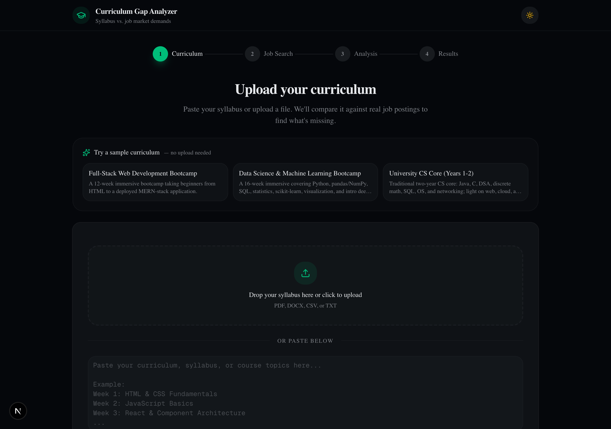
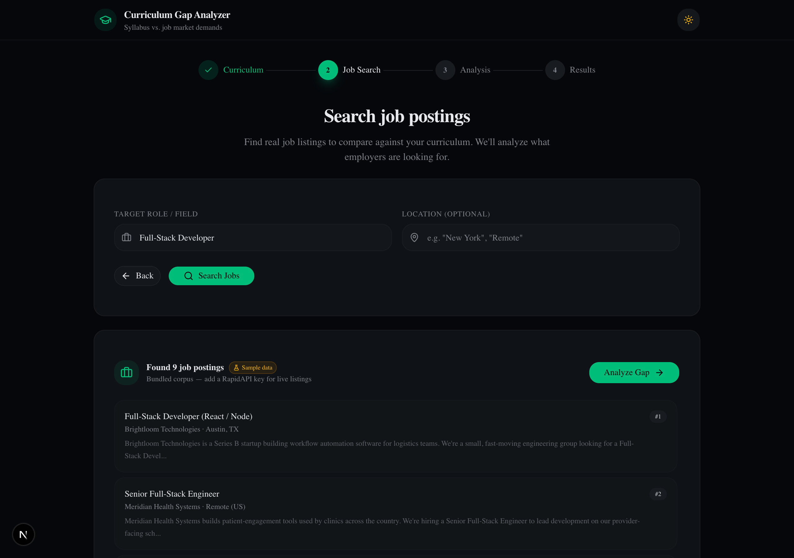
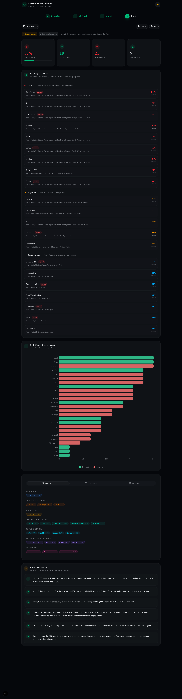

# Curriculum Gap Analyzer

**Find out what your syllabus is missing before your students do.**

Upload a bootcamp or university curriculum, pick a target role, and instantly see which skills employers are hiring for that your program doesn't cover — scored against real job postings by a deterministic, unit-tested engine.


> **Runs with zero API keys.** `git clone && npm install && npm run dev` gives you the complete flow — bundled sample curricula, a corpus of ~50 realistic job postings, and the full deterministic analysis engine. Add an Anthropic key to upgrade skill extraction to AI, and a RapidAPI key to swap the corpus for live listings. Nothing is stubbed; demo mode runs the real engine on real text.

---

## How It Works

### 1. Pick a sample or upload your curriculum

Start from a bundled sample (full-stack bootcamp, data-science bootcamp, or a university CS core) or drag-and-drop a PDF, DOCX, CSV, or TXT.

<p align="center">
  
</p>

### 2. Search for a target role

The suggested role is pre-filled from your sample. With a RapidAPI key it pulls live listings from LinkedIn, Indeed, Glassdoor and more; without one it serves a bundled corpus of realistic postings (clearly badged as sample data).

<p align="center">
  
</p>

### 3. Read your gap report

A coverage score, a **prioritized learning roadmap** (critical → recommended, with the companies asking for each skill), a demand-vs-coverage chart, categorized skill lists, and reproducible recommendations. Export as a Markdown report or JSON.

<p align="center">
  
</p>

---

## The engine (the interesting part)

The analysis is **hybrid** — AI does the one thing it's uniquely good at, and everything measurable is deterministic and testable.

```
 curriculum text ─┐
                  ├─► skill extraction ──► canonical taxonomy ──► matching + scoring ──► gap report
 job postings  ───┘   (LLM or rules)        (alias resolution)     (pure functions)
```

- **Canonical skill taxonomy** (`src/lib/skills/taxonomy.ts`) — ~170 skills, each with alias resolution (`js` → JavaScript, `react.js` → React, `k8s` → Kubernetes) and careful handling of the awkward cases: symbol-bearing names (`C++`, `C#`, `.NET`, `Node.js`), and the genuinely ambiguous single-letter languages (`C`, `R`, `Go`) which are only matched inside a technology list — a deliberate precision-over-recall choice.

- **Deterministic extractor** (`extract.ts`) — a single boundary-aware pass with longest-surface-first span masking, so `React Native` wins over `React` and `Node.js` is never mistaken for a bare `node`. Same input, same output, every time.

- **Matching & scoring engine** (`engine.ts`) — computes per-skill demand frequency, required-vs-preferred (from each posting's "nice to have" boundary), covered / missing / bonus classification, a demand-weighted coverage score, an evidence map, and the recommendations. **No LLM in this path** — every number traces back to a count you can see in the chart.

- **Two extractors, one interface** — with an Anthropic key, curricula are extracted by Claude via **structured tool use with a strict JSON Schema** (`llm-extract.ts`) for better recall on prose-heavy syllabi, then reconciled back onto the canonical taxonomy. Without a key, the deterministic extractor handles both sides. Either way, the scoring is identical and deterministic. If the LLM call fails, it falls back to the deterministic path — the app never hard-depends on the API.

This split is the whole point: **use AI for the fuzzy problem (reading intent out of messy text), and plain testable code for the exact one (counting, weighting, ranking).**

---

## Tech Stack

| Layer | Technology |
|-------|-----------|
| Framework | [Next.js 16](https://nextjs.org/) (App Router) + React 19 |
| Styling | [Tailwind CSS 4](https://tailwindcss.com/) + [shadcn/ui](https://ui.shadcn.com/) |
| AI | [Anthropic API](https://docs.anthropic.com/) — structured tool use for skill extraction |
| Job Data | [JSearch](https://rapidapi.com/letscrape-6bRBa3QguO5/api/jsearch) via RapidAPI (optional) |
| Charts | [Recharts](https://recharts.org/) |
| File Parsing | pdf-parse, mammoth, csv-parse |
| Tests | [Vitest](https://vitest.dev/) |

---

## Getting Started

### Prerequisites

- Node.js 18+

That's it. API keys are optional (see below).

### Run

```bash
git clone <your-repo-url>
cd curriculum-gap-analyser
npm install
npm run dev
```

Open [http://localhost:3000](http://localhost:3000) and click a sample — the full flow works with no configuration.

### Optional: enable live data & AI extraction

```bash
cp .env.example .env.local
```

| Key | Unlocks | Fallback without it |
|-----|---------|---------------------|
| `ANTHROPIC_API_KEY` | AI skill extraction from uploaded curricula | Deterministic taxonomy extractor |
| `RAPIDAPI_KEY` | Live job listings via JSearch | Bundled corpus of ~50 realistic postings |

The results dashboard always labels which mode produced it, so sample data is never passed off as live.

### Test

```bash
npm test
```

34 unit/integration tests cover taxonomy integrity, extraction edge cases (boundaries, symbol-bearing and ambiguous languages), the scoring math, and an end-to-end run over the bundled corpus.

---

## Project Structure

```
src/
├── app/
│   ├── page.tsx                  # 4-step wizard (input → search → analyze → results)
│   └── api/
│       ├── parse/route.ts        # extract text from uploaded files
│       ├── jobs/route.ts         # live JSearch, or bundled corpus fallback
│       ├── analyze/route.ts      # run the hybrid analysis pipeline
│       └── samples/route.ts      # sample curricula for the "try a sample" flow
├── components/
│   ├── curriculum-input.tsx      # upload + paste + sample picker
│   ├── job-search-form.tsx       # role/location search with source badge
│   ├── analyzing-view.tsx        # staged progress (parse → extract → match → score)
│   ├── analysis-dashboard.tsx    # scores, provenance, chart, export
│   ├── learning-roadmap.tsx      # gaps sequenced by demand, with evidence
│   ├── skill-gap-chart.tsx       # demand-vs-coverage bar chart
│   └── skill-list.tsx            # color-coded skill badges by category
├── lib/
│   ├── skills/
│   │   ├── taxonomy.ts           # canonical skills + alias index
│   │   ├── extract.ts            # deterministic extractor
│   │   ├── engine.ts             # matching, scoring, roadmap (pure)
│   │   ├── llm-extract.ts        # Claude structured-tool-use extractor
│   │   └── *.test.ts             # the test suite
│   ├── analysis.ts               # orchestrator: choose extractor, stamp provenance
│   ├── report.ts                 # Markdown report generator
│   ├── jobs.ts                   # JSearch client + country detection
│   ├── parser.ts                 # PDF / DOCX / CSV / TXT extraction
│   └── demo/index.ts             # bundled corpus loader + demo job search
└── data/
    ├── job-corpus.json           # ~50 realistic postings across 6 roles
    └── curricula.json            # 3 sample curricula with realistic gaps
```

---

## Design Notes

- **Precision over recall for ambiguous tokens.** `C`, `R`, and `Go` are common English words. Rather than flag every "go to the store" as the Go language, the extractor only accepts them inside a delimited technology list. It's a deliberate trade — documented and tested — and the kind of edge case that separates a real matcher from a naive keyword scan.
- **The coverage score is defensible.** It's the share of total employer demand (∑ frequency) that the curriculum covers — not an opaque AI judgment. You can reconstruct it by hand from the chart.
- **Honest provenance.** Every result is stamped with its mode (live/demo), extractor (AI/rule-based), and job source, and the UI surfaces all three.

## License

MIT — see [LICENSE](LICENSE).
